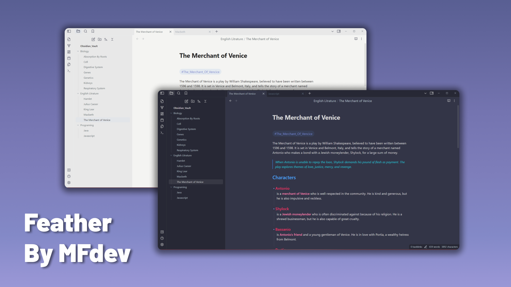

# Introducing Feather ✨

Feather is an Obsidian Theme greatly inspired by [obsidian-things](https://github.com/colineckert/obsidian-things). 

> This theme was built using code from [colineckert's](https://github.com/colineckert) Obsidian Things Theme. Please support colineckert's work!

# About Feather 🎁

- Dark And Light Themes
- Things 2 like Checkboxes
- Cool Code Blocks With Syntax Highlighting
- With the Style Settings community plugin, you can customize the colors
of bold, italic, highlighters, and block-quotes

# Themes

# Installation 🧑‍💻

1. Open the **Settings** in Obsidian
2. Navigate to **Appearances** tab under **Options**
3. Under the **Themes** section, click on the `Manage` button across from **Themes**
4. Search for `Feather` in the Filter text input
5. Click `Use` and then you're done! 🎉

# Feedback 📖
I will do my best to answer any issues and/or suggestions you may
have. Please submit an issue or raise a PR.

# Credits 🎊

I would like to thank [colineckert](https://github.com/colineckert) and his theme [obsidian-things](https://github.com/colineckert/obsidian-things) for his things 2 like checkboxes and base for this theme.Also, a huge thanks to [kepano](https://github.com/kepano) and his [Minimal Theme](https://github.com/kepano/obsidian-minimal) for some inspiration. 🎉🎉🎉

# Support Me 🫶

    
 Help Me Through Cryptocurrency 💵

#### Solana
``
HcJZna3AGBUPWgnCb6xHvQZ9hC7VB9uoZcg9ticwih4U
``

#### Ethereum
``
0x8F1609c1F7C2688E542FC1e81A52c8D9F36C4920
``

#### Bitcoin
``
bc1p39hs4xzjpjx62k5y305x9d2ylagehxs0lwpj90uz8cdz6pf7dg7s3xrjky
``

#### Sui
``
0x5338159aa2831413b3355d498ce464f242659169b8f2a24ab1ebc8055690ac89
``

